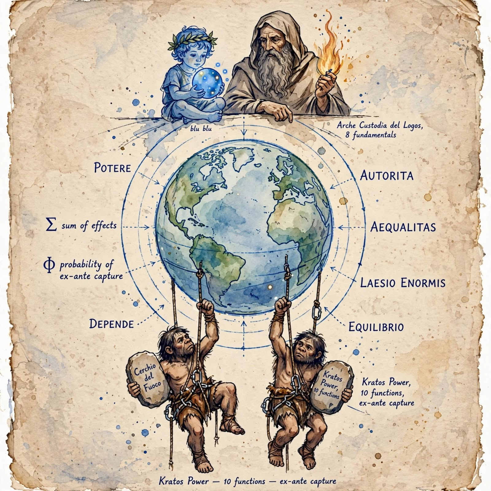
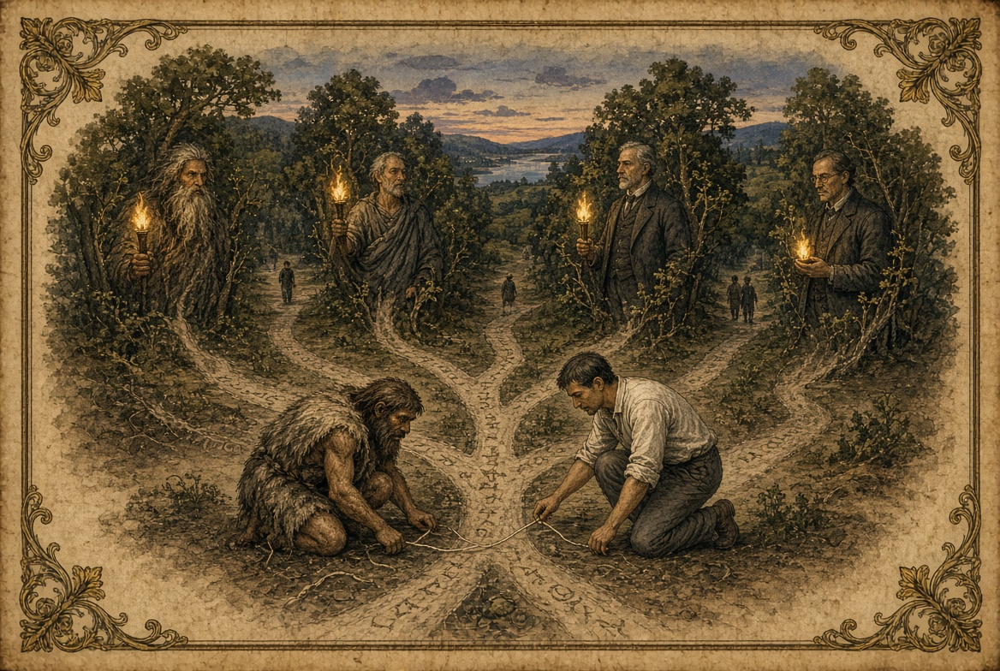
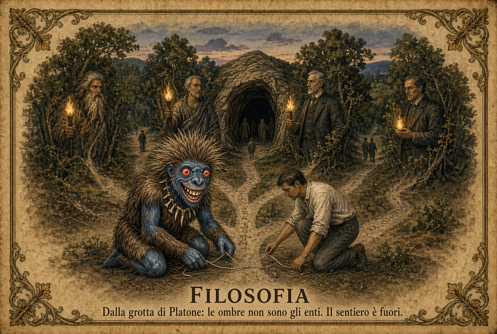

# Custodire-polemos-e-logos-
Per noi occidentali è un salto logico improbabile capire "io sono perché noi siamo" , per gli Ubuntu lo sarebbe comprendere appieno la logica dei tassi d'interesse e d'inflazione. 2 verità che devono coesistere.

**Autorità è la custodia del logos**  
Generalmente sono funzioni manifeste 
Arché/Autoritas

1. Tianming (Cina – Mandato del Cielo)  
2. Asabiyyah (Ibn Khaldun – solidarietà di gruppo)  
3. Oikonomia (Grecia – amministrazione orientata al bene)  
4. Aequalitas / Iustum pretium (Roma-Medioevo)  
5. Vital force / force vitale (tradizioni africane)  
6. Clan Mothers authority (Haudenosaunee / Irochesi)  
7. Royaner (capo della Grande Legge della Pace)  
8. Sapa Inka come mediatore cosmico (Inca)  
9. Divine king / k’uhul ajaw (Maya – re divino mediatore)  
10. Ariki / Rangatira (Maori – capo legittimo)  
11. Kīngitanga (movimento del re Māori)  
12. Curaca legittimo (Ande pre-incaiche e incaiche)  
13. Chieftainship without coercion (Amerindi amazzonici e nordamericani – Clastres)  
14. Elder / lineage elder (Africa tradizionale)  
15. Potere contrattuale ex post (esito di una contesa che può essere contestata) 
16. Derzhava divina / pomazannik (Russia ortodossa)  
17. De (virtù / potenza morale – Cina confuciana)  
18. Great Law of Peace (Haudenosaunee)  
19. Huaca / ancestor mediation (Ande)  
20. Respect / knowledge custodianship (Aboriginal Australian)  
21. Wazi’ / restraining power giusto (Khaldun)  
22. Logos relazione tra le cose (Eraclito)

**Potere è la cattura del polemos**  
Generalmente sono funzioni latenti 
Kratos/Potestas 

1. Chrematistics (Aristotele)  
2. Ba / forza coercitiva (Cina – Legalismo)  
3. Siloviki / sila (Russia – potere della forza)  
4. Vlast’ coercitiva (Russia)  
5. Tyranny / despotic rule (tradizione greca e africana)  
6. Capture of vital force (Africa – abuso del potere vitale)  
7. Coercive chieftainship (Amerindi – opposto al modello di Clastres)  
8. Potere conteso / conflitto per l’autorità  
9. Laesio enormis (diritto romano)  
10. Controproduttività (illich) 
11. Potere contrattuale ex ante (determina già l'esito della contesa) 
12. Complesso militare industriale (Eisenhower) 
13. Military supremacy senza mandato (Cina post-Zhou)  
14. Despotismo decentralizzato (Africa coloniale e post-coloniale)  
15. Power as coercion (Clastres – definizione negativa)  
16. Usurpazione del Sapa Inka / abuso del mandato divino (Inca)  
17. Forced labour / mit’a coercitiva (quando degenera)  
18. Patronage capture (Africa contemporanea e storica)  
19. Absolute potestas senza auctoritas (Roma degenerata)  
20. Force structures senza legitimation (Russia)  
21. Domination through violence or threat (Mesoamerica e Ande in casi di abuso)  
22. Cattura del polemos (Eraclito)

# Cerchio del fuoco — Neanderthal

Genealogia, etimologia, filosofia.

Scaffale aperto. Le etimologie restano vive solo se non le si impacchetta.

Autorità è la custodia del logos.  
Potere è la cattura del polemos.

Verità ≠ realtà. Nome ≠ ente. Definizione ≠ relazione.

Ogni cosa è cura e veleno. In tutto c’è uno spettro operativo. Ciò che non vediamo e non udiamo non è il nulla: è il resto.

Licenza di questo foglio: [CC BY-SA 4.0](https://creativecommons.org/licenses/by-sa/4.0/)

## Porte

- [custodire polemos e logos (PDF)](cerchio-del-fuoco-genealogia-polemos.pdf)
- [Cerchio del fuoco — community Zenodo](https://zenodo.org/communities/cechio_del_fuoco/records)
- [ORCID](https://orcid.org/0009-0006-1081-6355)
- [OSF](https://osf.io/qh4px/)
- [Zenodo per ORCID](https://zenodo.org/search?q=creators.orcid:0009-0006-1081-6355)
